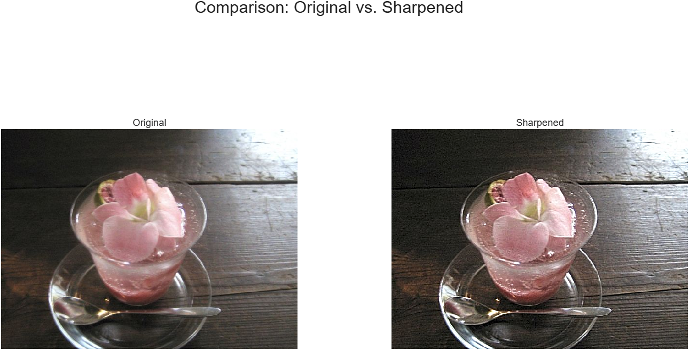
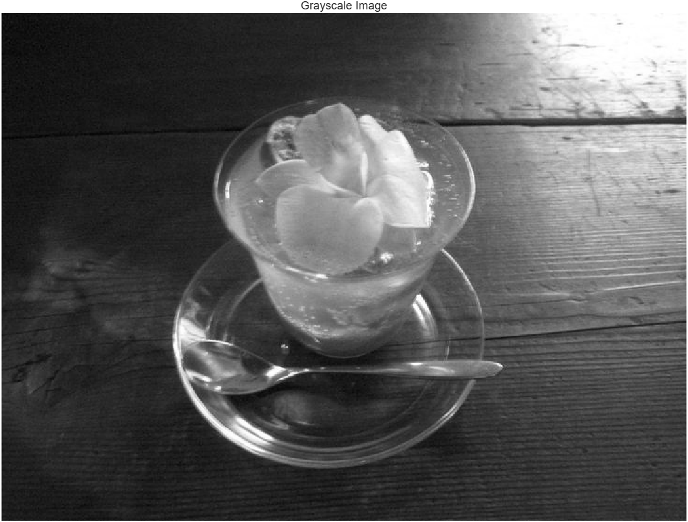
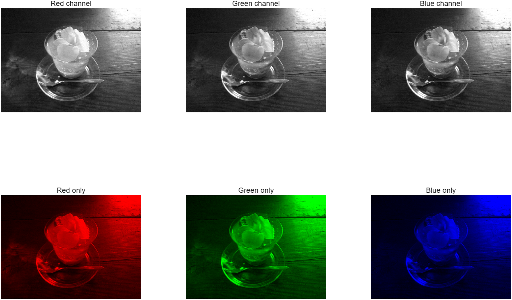
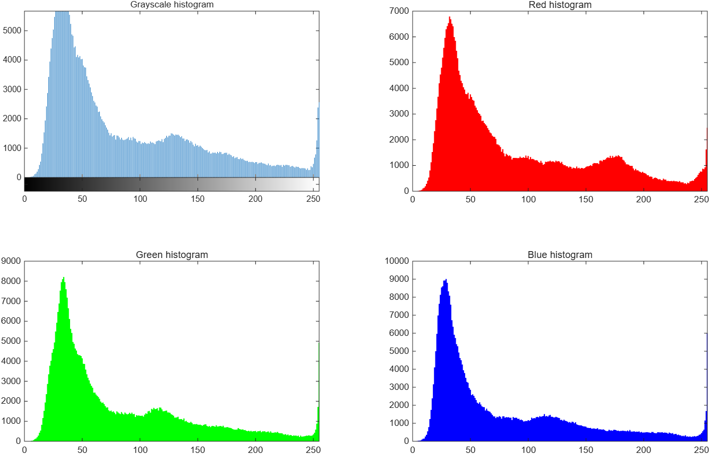
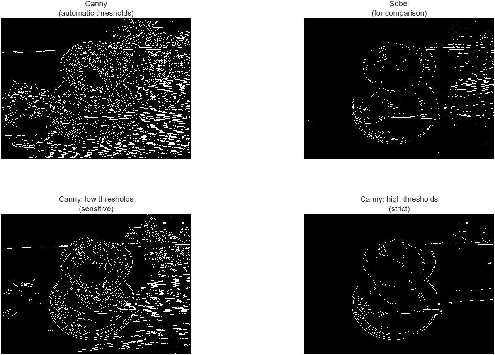
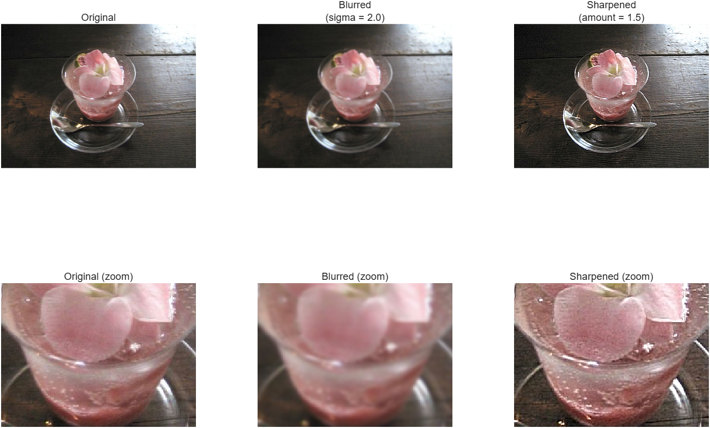

# Image Processing Mini-Lab

An interactive MATLAB project for exploring fundamental image processing techniques on your own photos. The program lets the user select an image and then displays its grayscale version, RGB color channels, pixel-intensity histograms, edges, brightness and contrast adjustments, and blur and sharpening effects.

I built this as my first personal MATLAB project to learn how digital images are represented and manipulated. The code is organized into sections and commented so that the processing steps are easy to follow.



## Features

- Choose your own image (`.jpg`, `.jpeg`, or `.png`) using a file dialog
- Convert color images to grayscale
- Analyze the red, green, and blue color channels separately
- Display pixel-intensity histograms and image statistics
- Detect edges using Canny and Sobel methods
- Adjust image brightness and contrast
- Apply automatic contrast stretching
- Apply Gaussian blur and image sharpening
- Compare processed results side by side with the original image
- Save processed images to a `results/` folder
- Compare and save multiple results during one run
- Handle cancelled dialogs, invalid inputs, unsupported files, and image-reading errors
- Change common program defaults using a settings section at the top of the script

## Requirements

- MATLAB R2026b
- Image Processing Toolbox

No other MATLAB toolboxes are required.

The project was developed and tested using MATLAB R2026b.

## How to Run

1. Clone or download this repository.
2. Open the project folder in MATLAB.
3. Open `image_processing_lab.m`.
4. Press **Run** to run the entire script.
5. Select a `.jpg`, `.jpeg`, or `.png` image.
6. Enter brightness, contrast, blur, and sharpening settings when prompted, or use the default values.
7. Select a processed result to compare with the original.
8. Choose whether to save the result or compare another result.

Saved images are placed in the `results/` folder.

## Project Structure

```text
ImageProcessingMiniLab/
├── image_processing_lab.m
├── README.md
├── .gitignore
├── sample_images/
├── results/
└── docs/
    └── images/
```

- `image_processing_lab.m` — main MATLAB program
- `sample_images/` — sample image for testing the program
- `results/` — processed images saved by the program
- `docs/images/` — screenshots used in this README

## How the Program Flows

| Section | What It Does |
|---|---|
| Settings | Stores commonly changed program settings and default values |
| 0–4 | Checks requirements, selects an image, validates the file, and loads it |
| 5–6 | Displays the original image and creates a grayscale version |
| 7 | Separates and analyzes the red, green, and blue channels |
| 8 | Displays histograms and image statistics |
| 9 | Performs Canny and Sobel edge detection |
| 10 | Adjusts brightness and contrast |
| 11 | Applies Gaussian blur and sharpening |
| 12 | Lets the user compare and save processed results |
| 13 | Displays a summary when the program finishes |

## MATLAB Concepts Demonstrated

### Image Fundamentals

- Images represented as matrices of pixel values
- RGB images represented using red, green, and blue channels
- Grayscale image representation
- Image data types such as `uint8`, `double`, and `logical`
- Matrix indexing and slicing

### Image Processing

The project uses several functions from MATLAB's Image Processing Toolbox, including:

- `imread` and `imwrite` for loading and saving images
- `imshow` for displaying images
- `rgb2gray` for grayscale conversion
- `imhist` for pixel-intensity histograms
- `edge` for Canny and Sobel edge detection
- `imadjust` and `stretchlim` for contrast adjustment
- `imgaussfilt` for Gaussian blur
- `imsharpen` for image sharpening

### MATLAB Programming

The project also gave me experience using:

- `if` / `else` statements
- `for` and `while` loops
- Cell arrays
- Matrix indexing
- `try` / `catch` error handling
- Input validation
- Local functions
- File and folder handling
- MATLAB dialog boxes
- Figures and subplots

## Example Results

### Original vs Grayscale



### RGB Channel Analysis



### Pixel-Intensity Histograms



### Edge Detection



### Original vs Processed


### Blur and Sharpen



## What I Learned

Building this project helped me understand how MATLAB can be used to process and analyze digital images. Some of the main things I learned were:

- How digital images are represented as matrices of pixel values
- How RGB images contain separate red, green, and blue channels
- How to convert color images to grayscale and analyze pixel intensity
- How histograms can help visualize the brightness and contrast of an image
- How Canny and Sobel edge detection can identify boundaries in an image
- How brightness and contrast adjustments change pixel values
- How Gaussian blur and sharpening affect image details
- How to use functions from MATLAB's Image Processing Toolbox
- How to validate user input and handle errors and cancelled dialogs
- How to organize a larger MATLAB program into understandable sections
- How to build a project incrementally by adding features, testing them, and fixing problems along the way

## Future Improvements and Roadmap

### Program Improvements

- Build a graphical interface using MATLAB App Designer
- Add sliders for brightness, contrast, blur, and sharpening
- Allow multiple image-processing operations to be applied in sequence
- Process multiple images from a folder automatically
- Separate larger processing operations into individual MATLAB functions
- Add automated tests

### More Image Processing

- Add image thresholding and segmentation
- Experiment with noise reduction
- Add histogram equalization
- Explore additional color spaces such as HSV and L*a*b*

### Computer Vision

Future versions could expand the project into computer vision by:

- Detecting and measuring objects in images
- Detecting lines and circles
- Exploring feature detection and image matching

### Machine Learning

A later version could explore machine learning by:

- Creating a small labeled image dataset
- Extracting features from images
- Training a simple image classifier
- Exploring pretrained neural networks and transfer learning

These are possible future improvements and are not currently implemented in the project.

## Author

Selina
